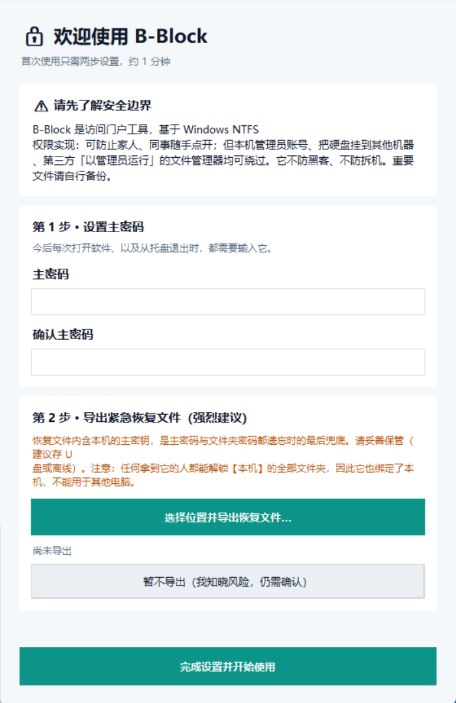
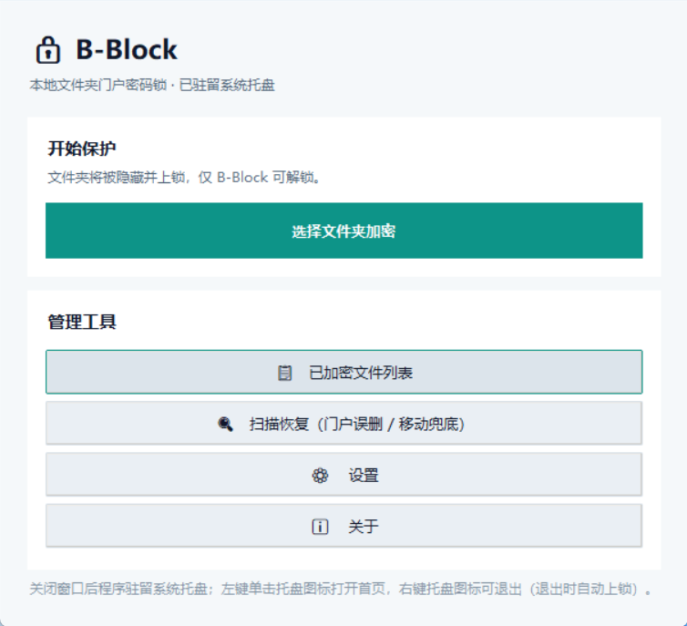
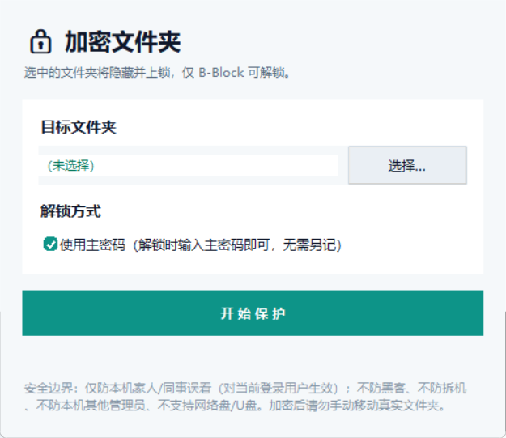
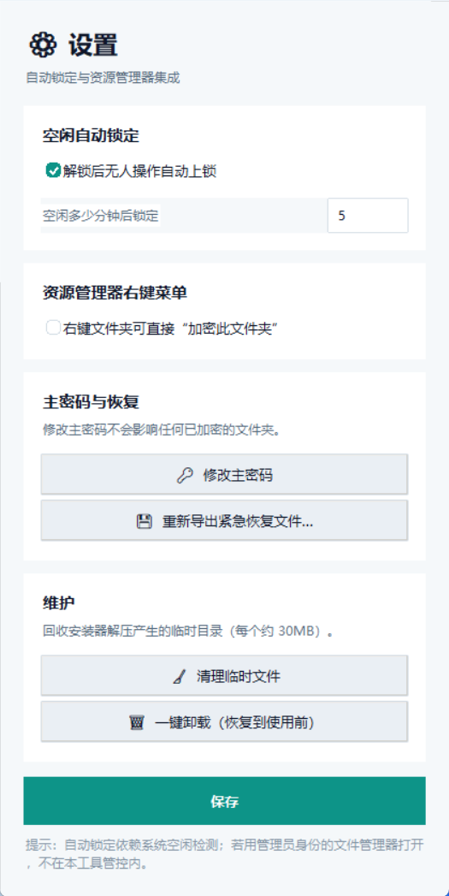

# B-Block 文件夹加密锁

B-Block 是一款轻量、纯本地的 Windows 文件夹加密工具。一键把任意文件夹变成「加密锁」：
文件夹被隐藏并加锁，原位置留下一个 `.lnk` 门户快捷方式，双击输入密码即可秒开，
关闭后自动重新上锁并退回系统托盘驻留。

## ✨ 特性

- **真正的访问控制**：基于 NTFS ACL（DENY）上锁，不止是「隐藏」——无密码无法读取，系统目录受保护不被误锁。
- **门户快捷方式**：加密后在原位置生成 `.lnk` 门户，双击即弹密码框，体验无缝，无需先开主程序。
- **双密码通道**：支持主密码（全局）与独立文件夹密码（每文件夹单独），二者均可解锁/取消保护。
- **系统托盘驻留**：解锁后驻留托盘，关闭主窗口不退出；空闲自动重新上锁，全退出后所有文件夹回到上锁态。
- **三种分发方式**（见 [release/](release/)）：
  - `B-Block.exe` — 免装单文件，双击即用（适合 U 盘 / 邮件携带）
  - `B-Block-免装版.zip` — 免装绿色版，解压即用、秒开（不写注册表 / 桌面）
  - `B-Block-Setup.exe` — 安装版，标准向导安装，桌面 / 开始菜单快捷方式
- **万能恢复文件**：可生成含主密钥的恢复文件，忘记主密码时重置（文件含主密钥明文，务必离线妥善保管）。
- **卸载安全闭环**：卸载需通过密码验证门，防止他人趁你离开时卸载清锁。

## 🖥️ 系统适配

| 项目 | 要求 |
|---|---|
| 操作系统 | **Windows 10 / Windows 11（64 位）** |
| 磁盘格式 | 仅支持**本地 NTFS** 磁盘（C 盘等系统盘默认即 NTFS） |
| 管理员权限 | 不需要——普通用户即可运行与安装（安装版写入当前用户目录） |
| 网络 | 不需要——纯本地运行，无任何数据上传 |

> ⚠️ 不支持：网络盘、U 盘、FAT/exFAT 格式磁盘（无 NTFS 权限机制，强行加密会造成「假保护」）。

## 📦 下载

前往 [release/](release/) 目录获取最新构建，或直接点击下载：

| 文件 | 说明 | 下载 |
|---|---|---|
| `B-Block.exe` | 免装单文件（双击即用，适合 U 盘 / 邮件携带） | [⬇ 立即下载](https://github.com/foxtap/B-Block/raw/main/release/B-Block.exe) |
| `B-Block-免装版.zip` | 免装绿色版（解压即用、秒开，不写注册表 / 桌面） | [⬇ 立即下载](https://github.com/foxtap/B-Block/raw/main/release/B-Block-%E5%85%8D%E8%A3%85%E7%89%88.zip) |
| `B-Block-Setup.exe` | 安装版（推荐日常使用，标准向导安装） | [⬇ 立即下载](https://github.com/foxtap/B-Block/raw/main/release/B-Block-Setup.exe) |

> 建议日常使用**安装版**或**免装绿色版**；双击 `B-Block.exe` 单文件仅作便携携带。

## 🚀 使用教程

### 1. 首次运行：设置主密码

首次启动会进入**首次使用向导**，设置全局主密码（也可顺便导出桌面万能恢复文件，
用于日后忘记密码时重置）：

### 2. 主界面

主界面提供三大入口：**开始保护（加密文件夹）**、**已加密文件列表** 与 **设置**：

### 3. 加密文件夹

点击「选择文件夹加密」→ 选中目标文件夹 → 设置独立密码（或跟随主密码）→
文件夹即被隐藏上锁，原位置留下 `.lnk` 门户入口：

### 4. 日常使用

- **解锁**：双击门户 `.lnk` → 输入主密码或文件夹密码 → 文件夹立即可用；关闭后自动重新上锁。
- **上锁与退出**：解锁后程序驻留系统托盘；完全退出（托盘右键 → 退出）后，所有文件夹回到上锁状态。

### 5. 设置页

可开关「空闲自动锁定」（解锁后无人操作自动上锁，默认开）与资源管理器右键菜单集成：

## 🔒 安全说明

- 加密基于**本机 Windows 用户账户 + NTFS 权限**，适用于「防止他人趁你离开时翻看」的场景；
  它**不替代**全盘加密（如 BitLocker）以对抗物理取证 / 离线攻击。
- 请牢记主密码。忘记时可凭**万能恢复文件**重置——该文件含主密钥明文，务必离线、单独妥善保管。
- 卸载需输入密码验证，避免他人借卸载流程清除你的加密锁。

## 📄 授权说明

本项目**免费使用，开源授权，但禁止商用**：

- ✅ 允许：个人与家庭免费使用、学习研究、随源码自由修改与再分发（非商业目的）。
- ❌ 禁止：任何形式的**商业用途**，包括但不限于销售、捆绑收费、SaaS/托管服务、企业内付费部署、以本项目牟利的二次分发。

> 注：当前仓库仅发布构建产物与界面截图，**源码暂未随仓库发布**；如后续开源源码，上述授权自动适用于源码。

## 👤 关于作者 / 项目主页

本项目由 **foxtap** 开发并维护。官方主页与最新发布：

- 项目主页 / 仓库：[github.com/foxtap/B-Block](https://github.com/foxtap/B-Block)

> 软件内「关于」窗口同样附此链接，便于核验官方出处。

---

*本仓库仅发布构建产物（release/）与界面截图（image/）；源码不在此仓库。*
